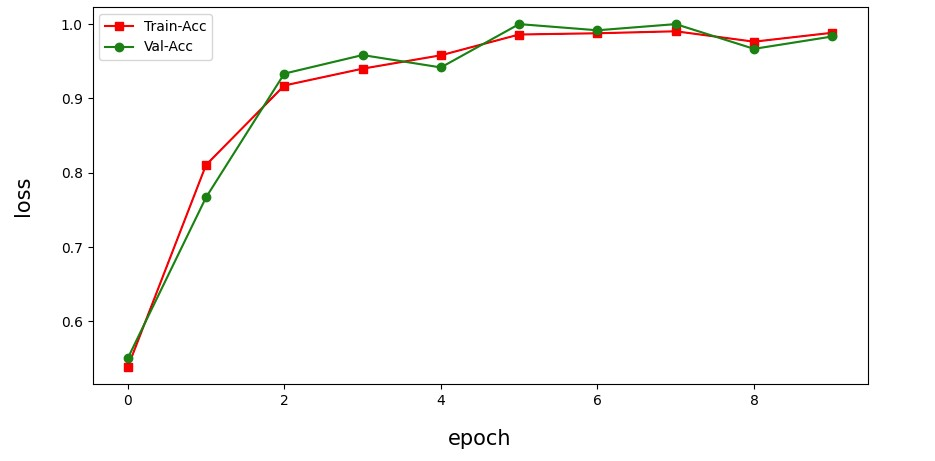

# NLP多分類模型訓練

>此頁面僅供產品展示，無程式碼和資料集

此專案成交於Tasker出任務平台，主要訓練一個自然語言分類模型，預測類別共32類，最終訓練及驗證準確度高於95%，獲得最後提案，並成交於2022/7/3。

模型訓練程式碼以及訓練資料結案後為得標者所有，因此僅列出訓練超參數，和最終的訓練結果，訓練過程和資料集皆不列出。

## 訓練平台

Colab

## 環境建置

`!pip install transformers`

## 預訓練模型

<https://huggingface.co/uer/roberta-base-finetuned-jd-full-chinese>

## 模型參數

| Name | Value |
| --- | --- |
| optimizer | Adam |
| loss function | CrossEntropyLoss |
| learning rate | 5e-5 |
| batch_size | 16 |
| epoch | 10 |

## 資料

| 類別 | 大小 |
| - | - |
| 訓練集 | 3000筆 |
| 驗證集 | 112筆 |

## 訓練結果

| 類別 | 準確度 |
| - | - |
| 訓練集 | 98.83% |
| 驗證集 | 98.33% |

> 準確度

>Loss

